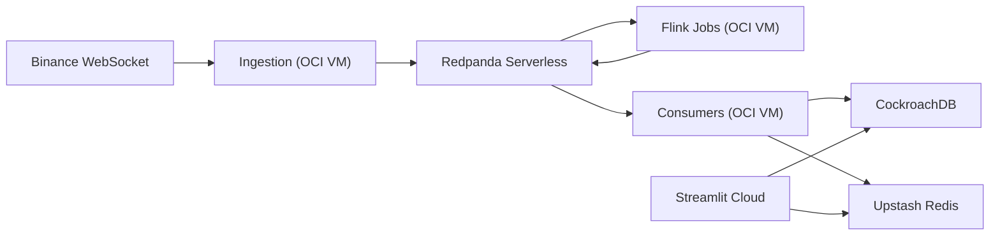

# Deployment Guide

This guide deploys the app using:
- CockroachDB (SQL)
- Upstash Redis (cache)
- Redpanda Serverless (Kafka-compatible broker)
- OCI VM (ingestion + consumers + Flink)
- Streamlit Community Cloud (dashboard)

## Architecture



## What Runs Where

| Component | Location |
| --- | --- |
| Ingestion | OCI VM (`compose.oci.yml`) |
| Consumers | OCI VM (`compose.oci.yml`) |
| Flink JobManager/TaskManager/Submitter | OCI VM (`compose.oci.yml`) |
| SQL database | CockroachDB |
| Redis cache | Upstash Redis |
| Kafka broker | Redpanda Serverless |
| Dashboard | Streamlit Community Cloud |

## Prerequisites

1. Accounts: OCI, CockroachDB, Upstash, Redpanda Cloud, GitHub, Streamlit Cloud.
2. Local tools: `terraform`, `git`, `ssh`.
3. Repo files already present:
   - `.terraform/*`
   - `compose.oci.yml`
   - `.env.oci.example`
   - `.github/workflows/infra-apply.yml`
   - `.github/workflows/deploy-oci.yml`

## Step 1: Create Managed Services

1. CockroachDB
   - Create serverless cluster.
   - Create SQL user + password.
   - Capture host, port (`26257`), db name, username, password.

2. Upstash Redis
   - Create Redis database.
   - Capture host, port, password.

3. Redpanda Serverless
   - Create resource group + serverless cluster.
   - Create Kafka user/password.
   - Create topics:
     - `orderbook.raw`
     - `orderbook.metrics`
     - `orderbook.metrics.windowed`
     - `orderbook.alerts`
   - Capture bootstrap servers (`host1:9092,host2:9092,...`).

## Step 2: Configure Runtime Env

1. Create runtime env file:
   - `cp .env.oci.example .env.oci`
2. Fill `.env.oci` with real credentials.
3. Keep `.env.oci` out of git.

## Step 3: Kafka Security Requirement (Flink)

Python producer/consumer supports SASL/TLS already.  
Flink jobs must also set Kafka security properties for Redpanda Serverless.

For each `KafkaSource.builder()` and `KafkaSink.builder()` in:
- `src/jobs/orderbook_metrics.py`
- `src/jobs/orderbook_alerts.py`
- `src/jobs/orderbook_windows.py`

add properties equivalent to:

```python
.set_property("security.protocol", settings.redpanda_security_protocol)
.set_property("sasl.mechanism", settings.redpanda_sasl_mechanism)
.set_property(
    "sasl.jaas.config",
    f'org.apache.kafka.common.security.scram.ScramLoginModule required '
    f'username="{settings.redpanda_username}" '
    f'password="{settings.redpanda_password}";',
)
```

If this step is skipped, Flink will fail to connect to Redpanda Serverless.

## Step 4: Provision OCI VM with Terraform

1. Create tfvars from example:
   - `cp .terraform/terraform.tfvars.example .terraform/terraform.tfvars`
2. Populate all required values.
3. Run:

```bash
terraform -chdir=.terraform init
terraform -chdir=.terraform plan -var-file=terraform.tfvars -out=tfplan
terraform -chdir=.terraform apply tfplan
terraform -chdir=.terraform output
```

4. Record VM public IP from output.

Recommended OCI shape for this compose stack:
- `VM.Standard.A1.Flex`
- `2 OCPU / 12 GB RAM / 100 GB boot volume`

## Step 5: Bootstrap and Run Services on OCI VM

1. SSH into VM:

```bash
ssh ubuntu@<OCI_VM_PUBLIC_IP>
```

2. Clone repo and prepare runtime env:

```bash
cd /opt
git clone <your-repo-url> order-book-pipeline
cd order-book-pipeline
mkdir -p logs
```

3. Create `/opt/order-book-pipeline/.env.oci` with production values.

4. Start runtime stack:

```bash
docker compose -f compose.oci.yml --env-file .env.oci up -d --build
```

5. Verify:

```bash
docker compose -f compose.oci.yml ps
docker compose -f compose.oci.yml logs -f ingestion
docker compose -f compose.oci.yml logs -f consumers
curl http://localhost:8081/overview
```

## Step 6: Deploy Streamlit Dashboard

1. In Streamlit Cloud, connect your GitHub repo.
2. Set app entrypoint to `dashboard/app.py`.
3. Add Streamlit secrets with production values needed by `src/config.py`:
   - Postgres vars
   - Redis vars
   - Redpanda vars
   - Flink host/port values (for health checks)
   - app/settings vars (`SYMBOLS`, thresholds, etc.)
4. Deploy and confirm dashboard loads.

## Step 7: CI/CD Setup (Hybrid)

### Infra workflow (manual)
- Workflow: `.github/workflows/infra-apply.yml`
- Trigger: `workflow_dispatch`
- Purpose: Terraform `init/plan/apply`

Required GitHub secrets:
- `OCI_API_PRIVATE_KEY_PEM`
- `TF_VAR_OCI_TENANCY_OCID`
- `TF_VAR_OCI_USER_OCID`
- `TF_VAR_OCI_FINGERPRINT`
- `TF_VAR_OCI_REGION`
- `TF_VAR_OCI_COMPARTMENT_OCID`
- `TF_VAR_OCI_ADMIN_CIDR`
- `TF_VAR_OCI_SSH_PUBLIC_KEY`
- `TF_VAR_COCKROACH_API_KEY`
- `TF_VAR_UPSTASH_EMAIL`
- `TF_VAR_UPSTASH_API_KEY`
- `TF_VAR_REDPANDA_CLIENT_ID`
- `TF_VAR_REDPANDA_CLIENT_SECRET`
- `TF_VAR_REDPANDA_KAFKA_PASSWORD`

### App deploy workflow (on push to main)
- Workflow: `.github/workflows/deploy-oci.yml`
- Trigger paths: `src/**`, `compose.oci.yml`, Dockerfiles, workflow file
- Purpose: SSH into VM and run `docker compose up -d --build`

Required GitHub secrets:
- `OCI_VM_HOST`
- `OCI_VM_USER`
- `OCI_VM_SSH_KEY`

## Rollback

1. On VM:
```bash
cd /opt/order-book-pipeline
git log --oneline -n 5
git checkout <last-good-commit>
docker compose -f compose.oci.yml --env-file .env.oci up -d --build
```

2. For infra rollback, run `terraform apply` against previous known-good config/state.

## Health Checklist

1. Ingestion logs show continuous publishes to `orderbook.raw`.
2. Flink UI shows 3 running jobs.
3. Consumers write metrics/alerts without commit errors.
4. CockroachDB tables receive fresh rows.
5. Upstash keys update for symbols in `SYMBOLS`.
6. Streamlit dashboard renders current metrics and charts.
