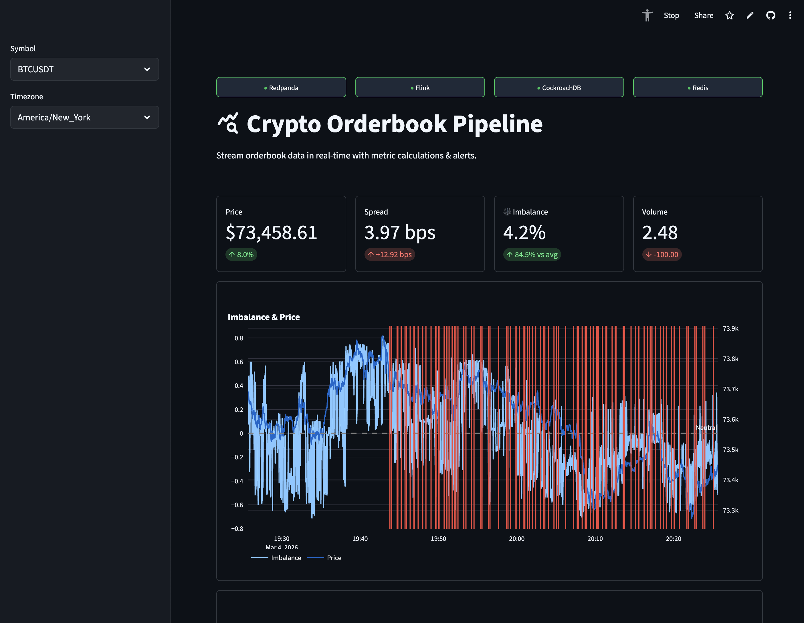
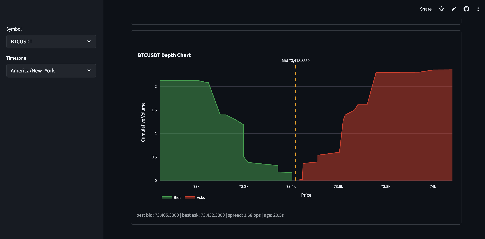
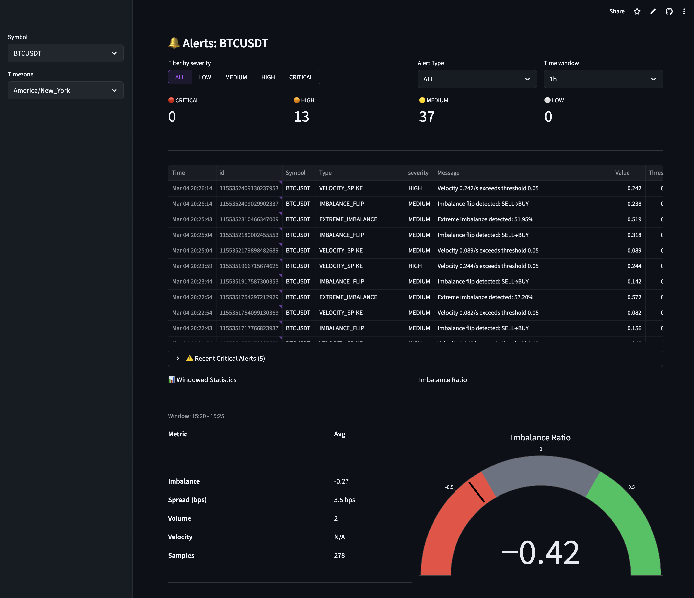
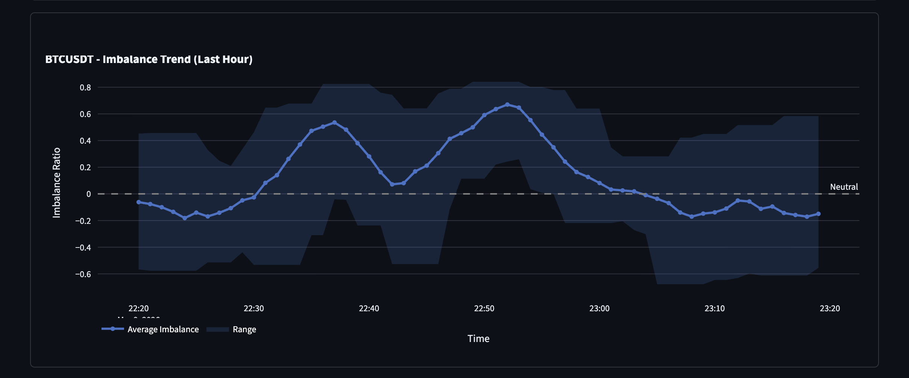
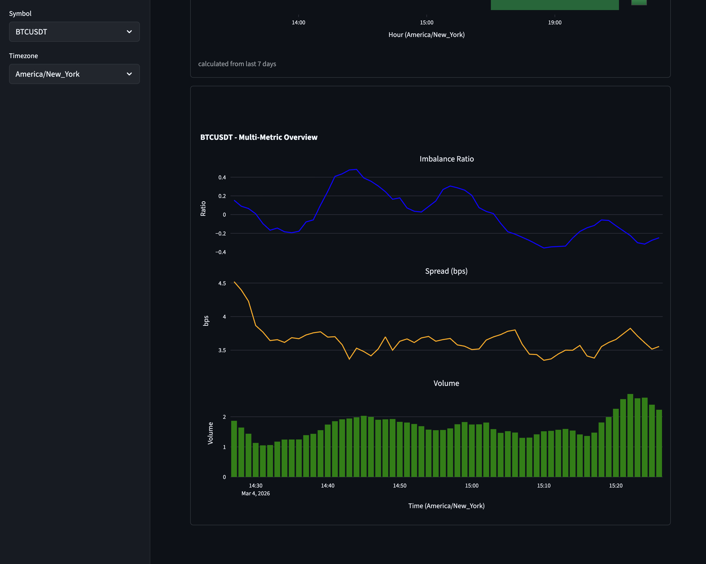
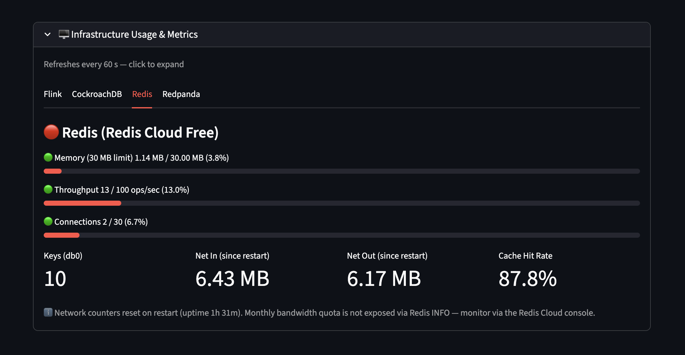

# Real-Time Order Book Monitor

A streaming data pipeline that monitors order book imbalances in real-time from exchanges.

## (contrived) Problem

Market participants benefit from having real time data and analysis in order to make trading decisions. Orderbook data can be informative of short term market dynamics, providing insight into market liquidity, supply/demand imbalances, and potential price movements.

This project processes orderbook data to produce realtime metrics and alerts. It takes orderbook data from a Binance websocket, calculates metrics, windowed data and real-time alerts, and presents the data in a Streamlit dashboard.

## Architecture

```
Binance WebSocket
      ↓
Python Ingestion Service
      ↓
Redpanda (orderbook.raw)        ← Message broker / buffer
      ↓
Apache Flink                    ← Stream processing
  ├── Windowed aggregations
  ├── Metrics calculation
  ├── Alert detection
  └── Complex event patterns
      ↓
Redpanda (orderbook.metrics / orderbook.alerts)
      ↓
  Consumers
  ├── CockroachDB               ← Persistent storage
  ├── Redis                     ← Low-latency cache
      ↓
  └── Streamlit Dashboard       ← Visualization (reads from DB/redis)
```

## Features

- **Real-time streaming** from Binance WebSocket API
- **Redpanda streaming platform** - Kafka-compatible message broker for scalable data pipelines
- **Multiple metrics**: Imbalance ratio, weighted imbalance, spread analysis, VTOB ratio
- **Intelligent alerts**: Extreme imbalance, imbalance flips, spread widening (real-time)
- **Time-series storage** with TimescaleDB for historical analysis
- **Redis caching** for ultra-low latency reads
- **Interactive dashboard** with Streamlit

[View the deployed dashboard](https://order-book-pipeline.streamlit.app/)

## Documentation

- [Development](docs/DEVELOPMENT.md)
- [Deployment](docs/DEPLOYMENT.md)
- [Database](docs/DATABASE.md)
- [Metrics](docs/METRICS.md)
- [Flink](docs/FLINK.md)
- [Redpanda](docs/REDPANDA.md)
- [Troubleshooting](docs/TROUBLESHOOTING.md)

## Quick Start (local docker compose)

### Prerequisites

- Docker Desktop installed and running
- 4GB+ RAM available
- Ports available: 5432, 6379, 8501 (and optionally 3000, 5050, 9092)

### Clone and Setup

```bash
# Create project directory
git clone https://github.com/scarlson1/order-book-pipeline.git
cd order-book-pipeline

# Create environment file (and update as necessary)
cp .env.example .env
mkdir -p logs
```

### Start All Services

```bash
# Start everything
docker-compose up -d

# if flink jobs don't show up - optionally run flink-job-submitter
# docker compose up -d --force-recreate flink-job-submitter

# View logs
docker-compose logs -f

# Check status
docker-compose ps
```

## Docker Compose Profiles

The docker-compose.yml uses profiles to optionally enable additional services:

- **Default** (no profile): Core services only (DB, Redis, Ingestion, RedPanda, Flink, Dashboard)
<!-- - **with-grafana**: Adds Grafana for advanced visualization -->
- **with-pgadmin**: Adds pgAdmin for database management

### Optional Services

```bash
# Start with pgAdmin (database management)
docker-compose --profile with-pgadmin up -d
```

### Access the Dashboard

Open your browser to:

- **Streamlit Dashboard**: http://localhost:8501
- **Flink Dashboard**: http://localhost:8081
- **RedPanda Dashboard**: http://localhost:8080/overview
- **pgAdmin** (optional): http://localhost:5050 (admin@orderbook.com/admin)
<!-- - **Grafana** (optional): http://localhost:3000 (admin/admin) -->

## Configuration

Edit `.env` to customize:

### Symbols to Monitor & Data Feed Env Vars

> Note: `SYMBOLS` and `UPDATE_SPEED` have significant impact on resources (DB storage, Flink VM)

```bash
SYMBOLS=BTCUSDT,ETHUSDT,SOLUSDT,BNBUSDT
DEPTH_LEVELS=20            # Fetch 20 levels from exchange
UPDATE_SPEED=100ms

# Metric Calculation Settings
CALCULATE_DEPTH=10         # Use top 10 levels for calculations
ROLLING_WINDOW_SECONDS=60
CALCULATE_VELOCITY=true

# Alert Thresholds
ALERT_THRESHOLD_HIGH=0.70  # 70% imbalance
ALERT_THRESHOLD_MEDIUM=0.50
SPREAD_ALERT_MULTIPLIER=2.0 # Alert when spread 2x normal
VELOCITY_THRESHOLD=0.05    # rapid changes
```

<!-- ### Stream Rate & Downsampling

There are a couple options to adjust the stream rate, which have a large impact on database size. The default 100ms rate results in 10 datapoints/symbol/second. With 3 symbols, that's ~2GB/day. There are two options to aggregate/reduce the rate:

- `UPDATE_SPEED`: change the update speed for the Binance websocket (`100ms` -> `1000ms`)
- `DOWNSAMPLING_ENABLED`: this will enable [`src/ingestion/downsampling.py`](./src/ingestion/downsampling.py), which aggregates data before passing along the data to Redpanda

> Note: downsample code was added in `src/ingestion/downsample.py`, but not integrated into the app. Thinking it'd be better to keep the data output to the same tables / data schema (& keep the flow through Flink). May be better to use Flink window functions if necessary to aggregate.

**Downsampling config scenarios:**

```bash
DOWNSAMPLING_ENABLED=false
```

- Publishes every tick to Redpanda
- Flink processes raw ticks
- High storage usage but good for debugging
- Use: Testing, development

**Scenario 2: Free Tier (Minimal Storage)**

```bash
DOWNSAMPLING_ENABLED=true
DOWNSAMPLE_BUCKET_SECONDS=60
DOWNSAMPLE_PUBLISH_TO_DB=false
DOWNSAMPLE_PUBLISH_TO_REDIS=true
```

- 1 metric per symbol per minute
- ~2 MB/day for 3 symbols
- 115+ days retention on 250MB
- Use: Limited storage, free tier

**Scenario 3: Production (Full Data)**

```bash
DOWNSAMPLING_ENABLED=true
DOWNSAMPLE_BUCKET_SECONDS=60
DOWNSAMPLE_PUBLISH_TO_DB=true
DOWNSAMPLE_PUBLISH_TO_REDIS=true
```

- Store metrics in both DB and Redis
- Full data preservation
- ~5 MB/day for 3 symbols
- Use: Production with good storage

**Scenario 4: High Volume (Aggressive)**

```bash
DOWNSAMPLING_ENABLED=true
DOWNSAMPLE_BUCKET_SECONDS=300
DOWNSAMPLE_PUBLISH_TO_DB=true
DOWNSAMPLE_PUBLISH_TO_REDIS=false
```

- 1 metric per symbol per 5 minutes
- ~0.5 MB/day for 10 symbols
- Use: Many symbols, minimal storage -->

**Storage Calculations**

UPDATE_SPEED=100ms
├─ Messages/sec: 30 (3 symbols × 10/sec)
├─ Daily storage: 1.3 GB
└─ 10GB limit: 7.7 days ❌

UPDATE_SPEED=1000ms
├─ Messages/sec: 3 (3 symbols × 1/sec)
├─ Daily storage: 130 MB
├─ 10GB limit: 77 days ✓
└─ Trade-off: 10x slower updates

<!-- Downsampling Only (60s bucket)
├─ Metrics/day: 4,320 (1 per symbol per 60s)
├─ Daily storage: 8.6 MB
├─ 10GB limit: 1,162 days (3.2 years) ✓✓
└─ Trade-off: No Flink, aggregated only

UPDATE_SPEED=1000ms + Downsampling
├─ Raw + metrics: 140 MB/day
├─ 10GB limit: 71 days ✓
└─ Trade-off: Complexity, still limited -->

<!-- **Data shapes**

Raw Tick (OrderBookSnapshot → Redpanda)
├─ Structure: [[bid_price, qty], [ask_price, qty], ...]
├─ Size: ~500 bytes per message
├─ Frequency: 10/sec (with UPDATE_SPEED=100ms)
├─ Fields: ~20 bid levels + ~20 ask levels
└─ Table: orderbook_raw (if stored)

Flink Output (OrderBookMetrics → orderbook_metrics)
├─ Structure: 18 numeric fields (imbalance, spread, etc.)
├─ Size: ~200 bytes
├─ Frequency: 1 per tick (same as input)
├─ Fields: mid_price, imbalance_ratio, spread_bps, etc.
└─ Table: orderbook_metrics (existing)

Downsampled Metric (DownsampledMetric → Redis/DB)
├─ Structure: 18 numeric fields (PRE-AGGREGATED)
├─ Size: ~2 KB per row
├─ Frequency: 1 per 60 seconds per symbol
├─ Fields: mean/min/max/std of imbalance, spread, OHLC, etc.
├─ Table: orderbook_metrics_downsampled (NEW)
└─ Contains: 600 ticks summarized in 1 row -->

## Project Structure

```
.
├── compose.oci.yml                          # Oracle VM deployment (consumers, flink, ingestion)
├── dashboard                                # Streamlit
│   ├── app.py
│   ├── components
│   │   ├── alert_feed.py
│   │   ├── gauge.py
│   │   ├── imbalance_trend.py
│   │   ├── metrics_cards.py
│   │   ├── multi_metric_windows.py
│   │   ├── orderbook_viz.py
│   │   ├── services_health_status.py
│   │   ├── timeseries.py
│   │   ├── volatility_heatmap.py
│   │   ├── windowed_aggregates.py
│   │   └── windowed_statistics.py
│   ├── data
│   │   ├── data_layer.py
│   │   ├── db_queries.py
│   │   ├── flink_queries.py
│   │   ├── redis_queries.py
│   │   └── redpanda_queries.py
│   ├── images
│   ├── pages
│   └── utils
│       ├── async_runner.py
│       ├── charts.py
│       └── formatting.py
├── db                                       # dbmate SQL schema management
│   ├── migrations
│   │   ├── 20260301000100_baseline_schema.sql
│   │   ├── 20260301000200_retention_ttl.sql
│   │   └── 20260302000100_add_avg_mid_price_windowed.sql
│   └── schema.sql
├── docker-compose.yml                       # run locally
├── Dockerfile.consumers
├── Dockerfile.dashboard
├── Dockerfile.flink
├── Dockerfile.ingestion
├── docs
│   ├── API.md
│   ├── ARCHITECTURE.md
│   ├── DEPLOYMENT.md
│   ├── DEVELOPMENT.md
│   ├── FLINK.md
│   ├── images
│   ├── METRICS.md
│   ├── REDPANDA.md
│   └── TROUBLESHOOTING.md
├── init-db.sql (deprecated - use dbmate)
├── justfile
├── LICENSE
├── logs
│   └── orderbook.log
├── Makefile
├── pyproject.toml
├── QUICKSTART.md
├── README.md
├── requirements-flink.txt
├── requirements.txt
├── src
│   ├── common
│   │   ├── database.py                      # SQL DB client
│   │   ├── models.py                        # pydantic models
│   │   ├── redis_client.py                  # Redis Client
│   │   ├── redpanda_client.py               # RedpandaConsumer & RedpandaProducer classes
│   │   └── utils.py
│   ├── config.py                            # environment variables & validation
│   ├── consumers
│   │   ├── db_consumer.py                   # Flink topics --> Database
│   │   ├── main.py
│   │   └── redis_consumer.py                # Flink topics --> Redis
│   ├── ingestion
│   │   ├── main.py
│   │   ├── metrics_calculator.py            # calc imbalance, volume, etc.
│   │   ├── orderbook_parser.py              #
│   │   └── websocket_client.py              # Binance websocket client
│   └── jobs
│       ├── orderbook_alerts.py              # Flink job: detect/generate alerts (metrics -> alerts)
│       ├── orderbook_metrics.py             # Flink job: raw -> metrics
│       ├── orderbook_windows.py             # Flink job: metrics -> windowed
├── terraform
│   ├── envs
│   │   └── prod
│   │       ├── backend.hcl
│   │       ├── backend.oci.hcl.example
│   │       ├── backend.tf
│   │       ├── main.tf
│   │       ├── outputs.tf
│   │       ├── providers.tf
│   │       ├── terraform.tfstate
│   │       ├── terraform.tfstate.backup
│   │       ├── terraform.tfvars
│   │       ├── terraform.tfvars.example
│   │       ├── tfplan
│   │       ├── tfplan-oci
│   │       ├── variables.tf
│   │       └── versions.tf
│   └── modules
│       ├── cockroach
│       │   ├── main.tf
│       │   ├── outputs.tf
│       │   └── variables.tf
│       ├── oci_vm
│       │   ├── cloud-init.yaml
│       │   ├── main.tf
│       │   ├── outputs.tf
│       │   └── variables.tf
│       ├── redis_cloud
│       │   ├── main.tf
│       │   ├── outputs.tf
│       │   └── variables.tf
│       ├── redpanda
│       │   ├── main.tf
│       │   ├── outputs.tf
│       │   └── variables.tf
│       └── upstash
│           ├── main.tf
│           ├── outputs.tf
│           └── variables.tf
├── tests
│   ├── e2e
│   │   └── test_full_pipeline.py
│   ├── fixtures
│   │   └── orderbook_snapshot.json
│   ├── integration
│   │   ├── test_database.py
│   │   ├── test_db_consumer.py
│   │   ├── test_flink_pipeline.py
│   │   ├── test_ingestion_pipeline.py
│   │   ├── test_redis_consumer.py
│   │   ├── test_redis.py
│   │   ├── test_redpanda.py
│   │   └── test_websocket.py
│   └── unit
│       ├── test_alert_engine.py
│       ├── test_ingestion_main.py
│       ├── test_metrics_calculator.py
│       ├── test_models.py
│       ├── test_redis_consumer.py
│       └── tests_orderbook_parser.py
└── uv.lock
```

---

## Useful Commands

### Service Management

```bash
# run once to build Flick with connectors
docker compose build --no-cache

# Start all services
docker-compose up -d

# Stop all services
docker-compose down

# Restart a specific service
docker-compose restart ingestion

# View logs
docker-compose logs -f ingestion
docker-compose logs -f dashboard

# Rebuild after code changes
docker-compose up -d --build

# resubmit Flink jobs
docker compose up -d --force-recreate flink-job-submitter
```

### Database Management

```bash
# Connect to database
docker-compose exec cockroachdb psql -U orderbook_user -d orderbook

# Run SQL queries
docker-compose exec cockroachdb psql -U orderbook_user -d orderbook -c "SELECT * FROM dashboard_summary;"

# Check table size
docker-compose exec cockroachdb psql -U orderbook_user -d orderbook -c "SELECT pg_size_pretty(pg_total_relation_size('orderbook_metrics'));"
```

### Redis Management

```bash
# Connect to Redis
docker-compose exec redis redis-cli

# Check cached data
docker-compose exec redis redis-cli KEYS "orderbook:*"

# Get latest metrics for a symbol
docker-compose exec redis redis-cli GET "orderbook:BTCUSDT:latest"
```

### Monitoring

```bash
# Check container resource usage
docker stats

# Check service health
docker-compose ps

# Follow all logs
docker-compose logs -f
```

## Troubleshooting

See [TROUBLESHOOTING.md](docs/TROUBLESHOOTING.md) for details

## Local Development

See [DEVELOPMENT.md](docs/DEVELOPMENT.md) for details

## Deployment

See [DEPLOYMENT.md](docs/DEPLOYMENT.md) for details

[Deployed Dashboard](https://order-book-pipeline.streamlit.app/)

## Screenshots













## Potential Features Roadmap

- Add data sources
  - [aggregate trade streams](https://developers.binance.com/docs/derivatives/usds-margined-futures/websocket-market-streams/Aggregate-Trade-Streams) could allow charts like [bookmap's](https://bookmap.com/en/features) volume bubbles
  - Add Binance Kline/Candlestick Stream: pushes updates for price, volume, and OHLC data every second for specific timeframes (1m to 1month)
  - Futures data could be added to analyze arbitrage opportunities
  - Streams from other exchanges / stocks
  - Alt data:
    - satellite imagery for retail traffic
    - credit card transaction data
    - twitter/reddit for sentiment/behavioral signals
- Analysis
  - Anomaly detection beyond rules (ML)
    - ML could better determine what "unusual" looks like from a specific symbol's typical behavior
    - detect multi-factor anomalies (imbalance + velocity + volume)
    - adaptive thresholds based on time of day / volatility regime
  - Imbalance Regime Classification (ML/LLM)
    - classify current market state into regimes:
      - accumulation / distribution
      - trend continuation vs reversal
      - low liquidity / stressed market
  - signal correlation discovery (ML)
    - when spread > X and imbalance velocity > Y, price moves Z direction 70% of the time
      - cross symbol correlations for pairs trading
      - leading indicators that precede large moves
  - smart alert summarization
    - "3 alerts in 2 minutes: extreme imbalance (0.85), spread widening 2.3x normal, velocity spike. This cluster has preceded +1% moves 65% of time historically."
  - **LSTM/Transformer models** for short-term price movement prediction (seconds to minutes)

- Trading
  - Connect to trading websocket
  - using reinforcement learning for backtesting/training/execution

## Contributing

This is a simple portfolio project, but suggestions and improvements are welcome!

## Support

For issues or questions, please check:

- Docker logs: `docker-compose logs`
- Database status: `docker-compose exec timescaledb pg_isready`
- Service health: `docker-compose ps`

## Credits

- [Streamlit Theme](https://github.com/jmedia65/awesome-streamlit-themes)
