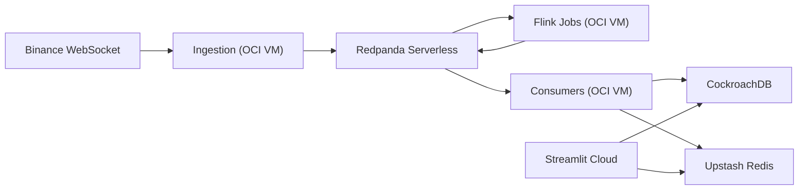

# Deployment Guide

This guide deploys the app using:

- [CockroachDB](https://www.cockroachlabs.com/)(SQL)
- [Redis Cloud](https://cloud.redis.io/) (cache)
- [Redpanda Serverless](https://www.redpanda.com/try-data-streaming) (Kafka-compatible broker)
- [OCI VM](https://www.oracle.com/cloud/) (ingestion + consumers + Flink)
- [Streamlit Community Cloud](https://streamlit.io/) (dashboard)

## Architecture



## What Runs Where

| Component                              | Location/Provider            |
| -------------------------------------- | ---------------------------- |
| Ingestion                              | OCI VM (`compose.oci.yml`)   |
| Consumers                              | OCI VM (`compose.oci.yml`)   |
| Flink JobManager/TaskManager/Submitter | OCI VM (`compose.oci.yml`)   |
| SQL database                           | CockroachDB                  |
| Redis cache                            | Redis Cloud                  |
| Kafka broker                           | ~~Redpanda Serverless~~ (VM) |
| Dashboard                              | Streamlit Community Cloud    |

## Prerequisites

1. Accounts: OCI, CockroachDB, Redis, Redpanda Cloud, GitHub, Streamlit Cloud.
2. Local tools: `terraform`, `git`, `ssh`, `dbmate`.
   - `docker compose`
   - Optional: `dbmate` CLI (for local/manual migration status checks)
3. Repo files already present:
   - `terraform/envs/prod/*`
   - `terraform/modules/*`
   - `compose.oci.yml`
   - `.env.oci.example`
   - `db/migrations/*`
   - `.github/workflows/infra-apply-oci.yml`
   - `.github/workflows/infra-apply.yml` (disabled stub)
   - `.github/workflows/deploy-oci.yml`

> Steps below are for manual deployment. See the following github actions for automated deployment
> [deploy-oci.yml](.github/workflows/deploy-oci.yml)
> [infra-apply-oci.yml](.github/workflows/infra-apply-oci.yml)
> [infra-apply.yml](.github/workflows/infra-apply.yml)

## Step 1: Create Managed Services

1. CockroachDB
   - Create serverless cluster.
   - Create SQL user + password.
   - Capture host, port (`26257`), db name, username, password.

2. Redis
   - Create Redis database.
   - Capture host, port, password.
   - Access api key & user api key (secret)

> **Note:** Upstash Redis monthly bandwidth limit is 50GB/mo.
> **Note:** RedisCloud monthly bandwidth limit is 30GB/mo.

3. ~~Redpanda Serverless~~ (moved to OCI VM to avoid $)
   - Create resource group + serverless cluster.
   - Create Kafka user/password.
   - Create topics:
     - `orderbook.raw`
     - `orderbook.metrics`
     - `orderbook.metrics.windowed`
     - `orderbook.alerts`
   - Capture bootstrap servers (`host1:9092,host2:9092,...`).

## Step 2: Configure Runtime Env

1. Create runtime env file:
   - `cp .env.oci.example .env.oci`
2. Fill `.env.oci` with real credentials.
3. Keep `.env.oci` out of git.

For CI/CD deploys, use GitHub Actions secrets instead of storing `.env.oci` in git:

1. Add repository secrets for runtime config keys from `.env.oci.example`.
2. `deploy-oci.yml` will render `/opt/order-book-pipeline/.env.oci` over SSH from those secrets on each deploy.

## Step 3: Apply Schema Migrations (Required)

`db/migrations/` is the source of truth for database schema, indexes, views, and retention settings.
Do not use `init-db.sql` for production CockroachDB initialization.

1. Set `DATABASE_URL` in `.env.oci` (from your Cockroach SQL user/cluster):

```bash
DATABASE_URL='postgresql://<user>:<password>@<host>:26257/<db>?sslmode=require'
```

2. Run migration hook with the OCI compose file:

```bash
docker compose -f compose.oci.yml --env-file .env.oci run --rm db-migrate
```

3. Optional status check (if local `dbmate` CLI is installed):

```bash
export DATABASE_URL='postgresql://<user>:<password>@<host>:26257/<db>?sslmode=require'
dbmate --migrations-dir db/migrations status
```

4. Confirm retention policies were applied by migration:
   - `orderbook_metrics` raw data retention: 7 days
   - `orderbook_metrics_windowed` retention: 30 days

## Step 4: Kafka Security Requirement (Flink)

Code below is already added - just documenting for reference.

Python producer/consumer supports SASL/TLS already.  
Flink jobs must also set Kafka security properties for Redpanda Serverless.

For each `KafkaSource.builder()` and `KafkaSink.builder()` in:

- `src/jobs/orderbook_metrics.py`
- `src/jobs/orderbook_alerts.py`
- `src/jobs/orderbook_windows.py`

add properties equivalent to:

```python
.set_property("security.protocol", settings.redpanda_security_protocol)
.set_property("sasl.mechanism", settings.redpanda_sasl_mechanism)
.set_property(
    "sasl.jaas.config",
    f'org.apache.kafka.common.security.scram.ScramLoginModule required '
    f'username="{settings.redpanda_username}" '
    f'password="{settings.redpanda_password}";',
)
```

If this step is skipped, Flink will fail to connect to Redpanda Serverless.

## Step 5: Provision OCI VM with Terraform

1. Create tfvars from example:
   - `cp terraform/envs/prod/terraform.tfvars.example terraform/envs/prod/terraform.tfvars`
2. Configure remote state backend:
   - `cp terraform/envs/prod/backend.oci.hcl.example terraform/envs/prod/backend.hcl`
   - update `bucket`, `namespace`, `tenancy_ocid`, `user_ocid`, `fingerprint`,
     `private_key_path`, and optionally `key` in `backend.hcl`.
3. Populate all required values in `terraform.tfvars`.
   - To temporarily skip Redpanda provisioning/reads, set:
     - `enable_redpanda = false`
4. Run:

> Note: terraform is also executed in github action when merged to `main` branch

```bash
terraform -chdir=terraform/envs/prod init -reconfigure -backend-config=backend.hcl
terraform -chdir=terraform/envs/prod plan -var-file=terraform.tfvars -out=tfplan
terraform -chdir=terraform/envs/prod apply tfplan
terraform -chdir=terraform/envs/prod output
```

If you already have local state and are switching to remote backend, run this once
instead of the `init -reconfigure` command above:

```bash
terraform -chdir=terraform/envs/prod init -migrate-state -backend-config=backend.hcl
```

For your Upstash/Cockroach “already exists” errors (import):

```bash
terraform -chdir=terraform/envs/prod import module.upstash.upstash_redis_database.this <upstash-db-id>
terraform -chdir=terraform/envs/prod import module.cockroach.cockroach_cluster.this <cockroach-cluster-id>
```

Or to only run the OCI portion:

```bash
terraform -chdir=terraform/envs/prod plan \
  -var-file=terraform.tfvars \
  -target=module.oci_vm \
  -out=tfplan-oci

terraform -chdir=terraform/envs/prod apply tfplan-oci
```

5. Record VM public IP from output.

Recommended OCI shape for this compose stack:

- `VM.Standard.A1.Flex`
- `2 OCPU / 12 GB RAM / 100 GB boot volume`

## Step 6: Bootstrap and Run Services on OCI VM

1. SSH into VM:

> May be easier/quicker to set up [Remote SSH in VS Code or Cursor](https://code.visualstudio.com/docs/remote/ssh)

```bash
ssh ubuntu@<OCI_VM_PUBLIC_IP>
```

2. Clone repo and prepare runtime env:

```bash
cd /opt
git clone <your-repo-url> order-book-pipeline
cd order-book-pipeline
mkdir -p logs
```

3. Create `/opt/order-book-pipeline/.env.oci` with production values.

4. Apply migrations on the VM before starting services:

```bash
cd /opt/order-book-pipeline
docker compose -f compose.oci.yml --env-file .env.oci run --rm db-migrate
```

5. Start runtime stack:

```bash
docker compose -f compose.oci.yml --env-file .env.oci up -d --build
```

`compose.oci.yml` also gates `consumers` on successful completion of `db-migrate` as a safety check.

> Issue: docker-compose-plugin doesn't appear to be installed (even though it's listed as a package in `cloud-init.yaml`)
> Debug logs: "The following packages were not found by APT so APT will not attempt to install them: ['docker-compose-plugin']"

[Stackoverflow solution](https://stackoverflow.com/questions/76031884/sudo-apt-get-install-docker-compose-plugin-fails-on-jammy)

```bash
# Add Docker's official GPG key:
sudo apt-get update
sudo apt-get install ca-certificates curl gnupg
sudo install -m 0755 -d /etc/apt/keyrings
curl -fsSL https://download.docker.com/linux/ubuntu/gpg | sudo gpg --dearmor -o /etc/apt/keyrings/docker.gpg
sudo chmod a+r /etc/apt/keyrings/docker.gpg

# Add the repository to Apt sources:
echo \
  "deb [arch="$(dpkg --print-architecture)" signed-by=/etc/apt/keyrings/docker.gpg] https://download.docker.com/linux/ubuntu \
  "$(. /etc/os-release && echo "$VERSION_CODENAME")" stable" | \
  sudo tee /etc/apt/sources.list.d/docker.list > /dev/null
sudo apt-get update

# Remember to start the docker container after installation by running
$: sudo service docker start
```

6. Verify:

```bash
docker compose -f compose.oci.yml ps
docker compose -f compose.oci.yml logs -f ingestion
docker compose -f compose.oci.yml logs -f consumers
curl http://localhost:8081/overview
```

## Step 7: Deploy Streamlit Dashboard

1. In Streamlit Cloud, connect your GitHub repo.
2. Set app entrypoint to `dashboard/app.py`.
3. Add Streamlit secrets with production values needed by `src/config.py`:
   - Postgres vars
   - Redis vars
   - Redpanda vars
   - Flink host/port values (for health checks)
   - app/settings vars (`SYMBOLS`, thresholds, etc.)
4. Deploy and confirm dashboard loads.

## Step 8: CI/CD Setup (Hybrid)

### Infra workflow (manual, OCI only)

- Workflow: `.github/workflows/infra-apply-oci.yml`
- Trigger: `workflow_dispatch`
- Purpose: Terraform `init/plan/apply` for `module.oci_vm` only, then sync `oci_vm_public_ip` to GitHub Actions variable `OCI_VM_HOST`
- Note: `.github/workflows/infra-apply.yml` is intentionally disabled.

Required GitHub secrets:

- `OCI_API_PRIVATE_KEY_PEM`
- `TF_VAR_OCI_TENANCY_OCID`
- `TF_VAR_OCI_USER_OCID`
- `TF_VAR_OCI_FINGERPRINT`
- `TF_VAR_OCI_REGION`
- `TF_VAR_OCI_COMPARTMENT_OCID`
- `TF_VAR_OCI_ADMIN_CIDR`
- `TF_VAR_OCI_SSH_PUBLIC_KEY`

Required GitHub variables (Terraform remote state backend):

- `TF_STATE_BUCKET` (OCI Object Storage bucket for state)
- `TF_STATE_NAMESPACE` (OCI Object Storage namespace)
- `TF_STATE_KEY` (optional; defaults to `orderbook-pipeline/prod/terraform.tfstate`)

### App deploy workflow (on push to main)

- Workflow: `.github/workflows/deploy-oci.yml`
- Trigger paths: `src/**`, `db/migrations/**`, `compose.oci.yml`, Dockerfiles, workflow file
- Purpose: render `.env.oci` from GitHub secrets, run DB migrations, then SSH into VM and run `docker compose up -d --build`

Required GitHub secrets:

- `OCI_VM_USER`
- `OCI_VM_SSH_KEY`
- `REDIS_CLOUD_API_KEY` (access api key)
- `REDIS_CLOUD_SECRET_KEY` (user api key)

Required GitHub variable or secret:

- One of: `OCI_VM_HOST` variable (preferred, auto-synced by `infra-apply-oci.yml`) or `OCI_VM_HOST` secret (fallback).

Runtime keys consumed by `.github/workflows/deploy-oci.yml` and written into `.env.oci`:

Required (must resolve to a non-empty value at deploy time):

- `DATABASE_URL` (secret)
- `POSTGRES_HOST` (secret)
- One of: `POSTGRES_PORT` variable or secret
- One of: `POSTGRES_DB` variable or secret
- `POSTGRES_USER` (secret)
- `POSTGRES_PASSWORD` (secret)
- One of: `POSTGRES_SSLMODE` variable or secret
- One of: `REDIS_HOST` variable or secret
- One of: `REDIS_PORT` variable or secret
- One of: `REDIS_SSL` variable or secret
- `REDPANDA_BOOTSTRAP_SERVERS` (secret)
- One of: `REDPANDA_TOPIC_PREFIX` variable or secret
- One of: `REDPANDA_SECURITY_PROTOCOL` variable or secret
- One of: `REDPANDA_SSL_CHECK_HOSTNAME` variable or secret
- One of: `REDPANDA_KAFKA_PORT` variable or secret
- `FLINK_HOST` (secret)
- `FLINK_PARALLELISM` (secret)
- `FLINK_PORT` (secret)
- `BINANCE_WS_URL` (secret)
- `SYMBOLS` (secret)
- `DEPTH_LEVELS` (secret)
- `UPDATE_SPEED` (secret)
- `CALCULATE_DEPTH` (secret)
- `ROLLING_WINDOW_SECONDS` (secret)
- `CALCULATE_VELOCITY` (secret)
- `ALERT_THRESHOLD_HIGH` (secret)
- `ALERT_THRESHOLD_MEDIUM` (secret)
- `SPREAD_ALERT_MULTIPLIER` (secret)
- `VELOCITY_THRESHOLD` (secret)
- `LOG_LEVEL` (secret)
- `LOG_FILE` (secret)
- `ENVIRONMENT` (secret)

Also referenced by deploy workflow (set if your environment needs them):

- `REDIS_PASSWORD` (secret)
- `REDIS_URL` (secret)
- `REDPANDA_SERVICE` (secret)
- One of: `REDPANDA_SASL_MECHANISM` variable or secret
- One of: `REDPANDA_USERNAME` variable or secret
- `REDPANDA_PASSWORD` (secret)

### `TF_VAR_*` vs deploy runtime secrets

Yes, they are different.

- `TF_VAR_*` secrets are used by `.github/workflows/infra-apply-oci.yml` (Terraform infrastructure provisioning).
- Runtime app secrets above are used by `.github/workflows/deploy-oci.yml` (SSH deploy + `.env.oci` rendering).

Do you need to keep `TF_VAR_*`?

- Keep them if you still run `infra-apply-oci.yml` for VM/infrastructure updates.
- If you no longer use Terraform workflow and only run deploys to an existing VM, `TF_VAR_*` can be removed.

## Rollback

1. On VM:

```bash
cd /opt/order-book-pipeline
git log --oneline -n 5
git checkout <last-good-commit>
docker compose -f compose.oci.yml --env-file .env.oci up -d --build
```

2. For infra rollback, run `terraform apply` against previous known-good config/state.

## Health Checklist

1. Ingestion logs show continuous publishes to `orderbook.raw`.
2. Flink UI shows 3 running jobs.
3. Consumers write metrics/alerts without commit errors.
4. CockroachDB tables receive fresh rows.
5. Upstash keys update for symbols in `SYMBOLS`.
6. Streamlit dashboard renders current metrics and charts.

## Monitoring

TODO
